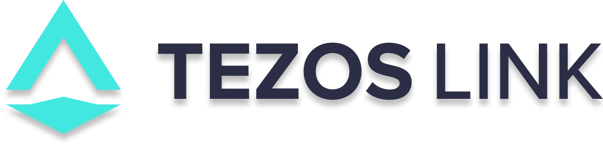

# 

 

Tezos link is a gateway to access to the Tezos network aiming to improve developer experience when you are developping Tezos applications.
It provides an easy access to Tezos-nodes.

The project is hosted in AWS by [OCTO Technology](https://www.octo.com/) and is under the supervision of the [Tezos Foundation](https://tezos.foundation/).

<TODO>

## References

This repo took some ideas & code from:

- https://github.com/tezexInfo/TezProxy
- https://github.com/AymericBethencourt/serverless-mern-stack/
