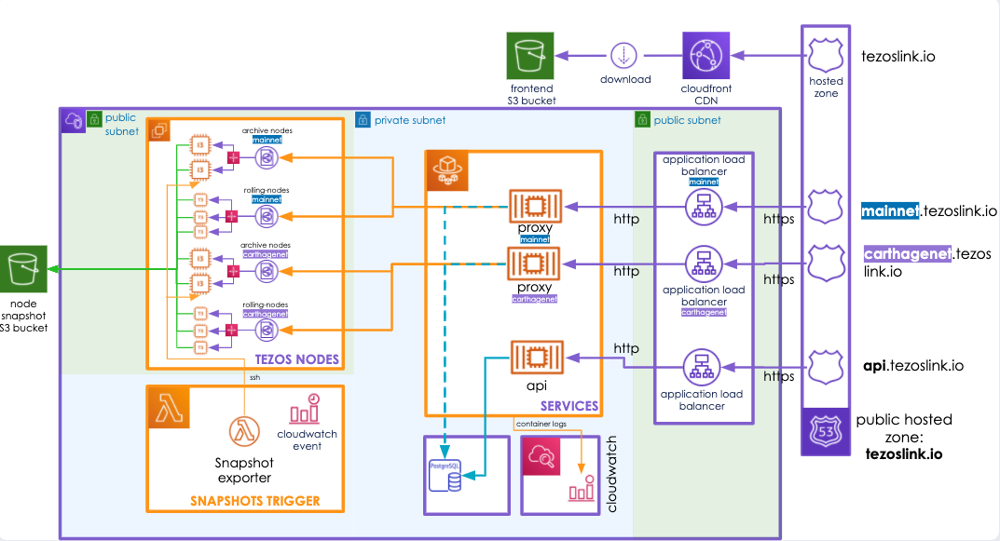

# Architecture

The TezosLink's architecture can be split in few parts:
- Tezos nodes part
- The Proxy part
- The Web part (the backend API and it associated frontend)
- The auxiliary services (monitoring, database, storage...)

This project was initially thought to be optimized on a cloud provider. During it development, we choose to deploy it on AWS.
We used the dedicated `terraform providers` to manage resources and we don't implement TezosLink for other cloud providers like Azure or GCP.

The representation of the architecture:

Let's dive into those differents parts.

## Nodes network

The main principle of TezosLink project is to deploy Tezos nodes and make them accessible next to a dedicated proxy. Those nodes are deployed by an AWS Autoscaling Group which permits to smartly scale-up/down based on the current traffic.

TezosLink can handle two Tezos networks (`mainnet` and `carthagenet`). For every network, we deploy two sets of machines:

`Archive` nodes which contains all informations about the blockchain since the beginning of the network. Due to the high quantity of informations and the high needs in I/O, we choose a machine type [i3.large](https://aws.amazon.com/ec2/instance-types/i3/) proposed by AWS.
Those machines are equipped with:
- 2 vCPU
- 15.25 GiB of RAM
- a native storage of 475 GB (NVMe SSD)

The main advantage of the i3 machine is the storage disk integrated natively on it and avoid to paid for the storage (which is expensive for a storage disk with high IOPS).

`Rolling` nodes which contains informations on the last cycle of the blockchain. Those nodes have small needs in comparison of archive nodes and we choose to put them on smaller machines ([t3.medium](https://aws.amazon.com/ec2/instance-types/t3/)) and generate more of them.
Those machines are equipped with:
- 2 vCPU (burstable)
- 4 GiB of RAM
- 10 GB of native storage (standard SSD)

When a machine start, it need to retrieve a recent version of the blockchain to be sync with it and ready as soon as possible. To do this, the virtual machine can get a snapshot based on an archive node on an `S3 bucket`.

The snapshot process is executed by an AWS lambda function named `snapshot-<network name>` which connect to an archive node with SSH and run a systemd service in charge of the snapshot creation and upload. Each lambda is triggered by a cron event every 12h.

> Warning: The archive process consume a lot of CPU and slow the machine which execute it.

## The Proxy

The `proxy service` is a software developed by the team which handle:
- the redirection to the node which can satisfied the request (rolling node for request which need only the last cycle or archive node for more power).
- The authentification of the user with a token.
- The count of request for a user.

This proxy is a golang service deployed inside a container. This container is deployed on an [AWS Elastic Container Service](https://aws.amazon.com/ecs/) using the serverless mode (also named FARGATE mode).

Each container connects with a managed Postgresql database and store data like number of request for a user...

An autoscaling system was placed on proxies containers to autoscale if the load is too important to handle.

In front of proxy's container, we find a loadbalancer with a dedicated dns `<network name>.tezoslink.io`, accessible from internet, in charge of the loadbalancing between them.

## The web services

The webservice can be cutted in two parts:

The `backend API` in charge of
- handling the connection with the database
- to handle request from the internet to generate api-keys, get metrics...
The API was coded in Golang and placed inside a container. Like the Proxy, the container is run in the ECS cluster and it is exposed next to the url `api.tezoslink.io`

A `frontend` service using `React` was deployed inside a Cloudfront and exposed on the main url `tezoslink.io`.

## Auxiliary services

Around the applications is running few services which permits to improve the maintenance of the application.

A big part of those services are centralized in [AWS Cloudwatch](https://aws.amazon.com/fr/cloudwatch/).
This service permits
- To centralize logs from a lot of the application components (lambda, containers...).
- To watch containers and machines to trigger autoscaling process.
- To create dashboards to keep an eye on infrastructure behaviors during loadtests.