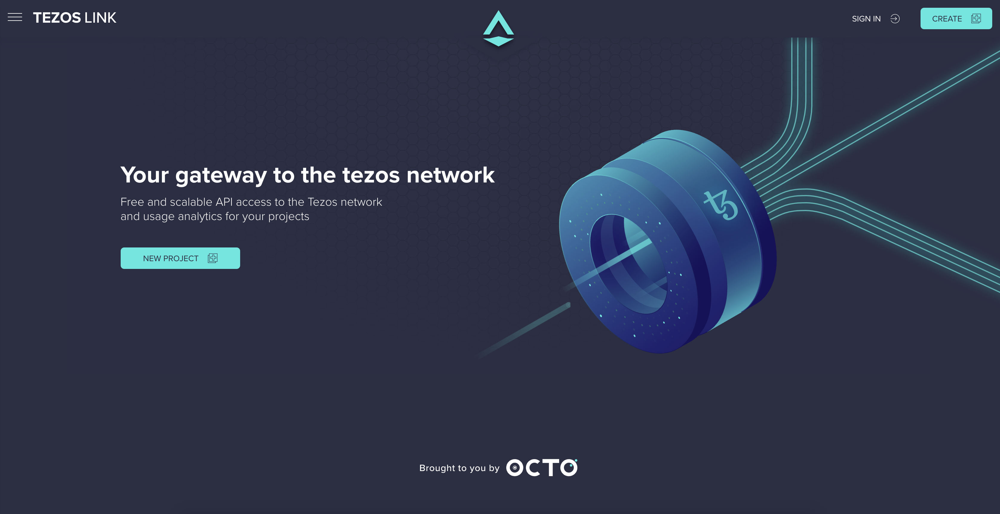

# Frontend server

The webserver in charge of the frontend that you can find at tezoslink.io.



## Requirements

- `Yarn` (setup with 1.22.0)
- `Node.js` (setup with 11.14.0)

## Dependencies

- A `TezosLink API` server

## Build the frontend server

In the root folder of the project, please run the following commands to build frontend assets:

```bash
# Retrieve dependancies
$> cd web
$> yarn install

# compile frontend server assets
$> make build-frontend
```

## Deploy the frontend server

> You will need AWS credentials setup on your machine, please ask a **maintainer** to deploy your solution.

To deploy the front, you can:
- run the command `make deploy-frontend`.
- use the continuous deployment pipeline.

### Connected with a local API server (development purpose)

To connect to a local environment. Once every container where builded, please run the command:

```bash
$> make run-dev
```

It will deploy every service and a web server connected to the API
loaded by the docker-compose (don't forget to stop the docker-compose with `make stop`).

### Connected with the deployed API server (integration purpose)

To connect to the deployed API server, you can use the following command:

```bash
$> make run
```

It will deploy every service and a web server connected to the API
loaded by the docker-compose (don't forget to stop the docker-compose with `make stop`).

## Environment variables

- `REACT_APP_BACKEND_URL` (default: `api.tezoslink.io`): The URL used to connect to API service.