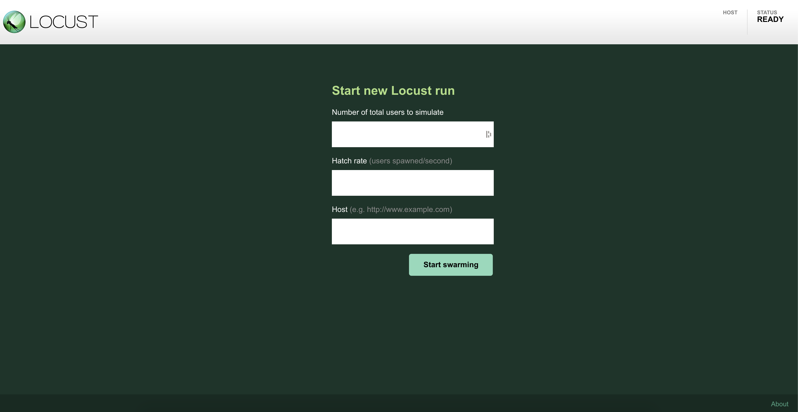
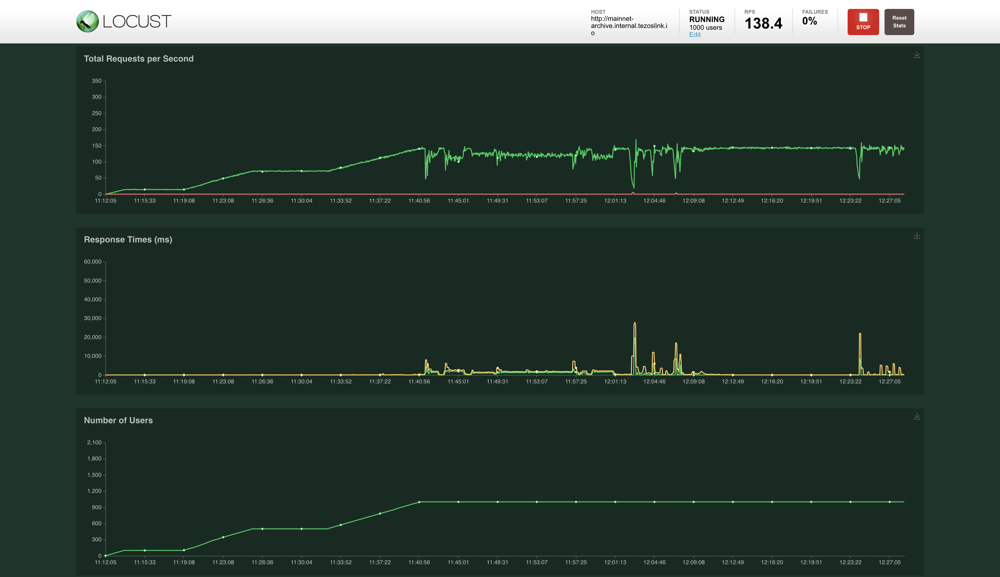

# Loadtest on the application

## Requirements

A remote machine with an access over internet on the port `8089`.

On this machine:
- `python` (3.7)
- `pip`
- `virtualenv` (nice to have)

## How to run the loadtest

First, copy the folder perf in the distant machine (with the command `scp`).

Connect on the machine and run the following commands:
```bash
# Setup a virtualenv to install Python dependancies
virtualenv venv
source ./venv/bin/activate

# Install dependancies to run locust
pip install -r requirements.txt

# Start the locust webserver
locust -f locust_load_on_head.py
```

> Tips: you can setup a service systemd to run locust. It permits to avoid the server discconnection if the ssh connection is broken due to connection problem.

Once the server is started, go on the url `ip_adress:8089` and you should see the following webpage.



Enter
- the url to test (here `mainnet-archive.internal.tezoslink.io` or `mainnet-rolling.internal.tezoslink.io`)
- the max user threashold
- the number of new user every sec until the max user threashold is reached.

Here we are, the test started. You can see graphs in the option.
You should see something link this at the end.



> Warning: the result is stored inside your browser and you could lose your result if you refresh the page so be aware of it.

Enjoy your test.